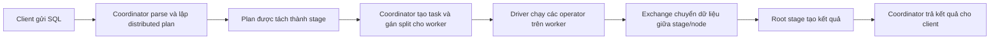

# Trino thực thi truy vấn như thế nào

> Tóm tắt theo [Trino concepts — current](https://trino.io/docs/current/overview/concepts.html) (đối chiếu Trino 483 ngày 2026-07-21).

Trino là distributed SQL query engine: client gửi SQL đến coordinator, coordinator lập kế hoạch và điều phối công việc, còn worker đọc dữ liệu từ connector, xử lý song song và trao đổi dữ liệu trung gian. Trino không phải nơi lưu dữ liệu; catalog và connector xác định nơi dữ liệu nằm và cách truy cập nó.

## 1. Luồng đời của một query



1. Client gửi một SQL statement tới coordinator qua giao thức client của Trino.
2. Coordinator parse statement, tạo query và distributed query plan; coordinator không chỉ chuyển tiếp SQL tới data source.
3. Plan được biểu diễn thành cây stage. Coordinator chuyển stage thành các task liên kết, chạy trên worker.
4. Với stage đọc nguồn, coordinator hỏi connector về các split có thể đọc và theo dõi task/worker đang xử lý split nào.
5. Worker chạy task bằng nhiều driver song song. Driver nối các operator để đọc, biến đổi và tạo output.
6. Khi cần ghép dữ liệu từ nhiều task hoặc stage, exchange truyền dữ liệu trung gian qua network. Root stage tập hợp output cuối cùng; coordinator lấy kết quả và trả dần cho client.

Mỗi query là một operation có trạng thái. Trong Web UI, luồng thường là `QUEUED` → `PLANNING` → `STARTING` → `RUNNING` → `FINISHING` → `FINISHED`; query cũng có thể là `BLOCKED` hoặc `FAILED`.

## 2. Các đơn vị thực thi

| Khái niệm | Vai trò |
| --- | --- |
| Statement | Văn bản SQL do client gửi. |
| Query | Statement sau khi Trino tạo cấu hình và thành phần thực thi. Query gồm plan, stage, task, split, connector và các thành phần khác. |
| Stage | Một phần logic của distributed plan. Các stage tạo thành cây; root stage nhận output từ stage bên dưới. Stage không trực tiếp chạy trên worker. |
| Task | Đơn vị công việc thực tế của một stage trên một worker. Task có input/output và chạy nhiều driver song song. |
| Split | Một phần của dữ liệu nguồn mà task xử lý; connector cung cấp các split khi scheduler lập lịch. |
| Driver | Chuỗi instance operator trong bộ nhớ, có một input và một output. Đây là mức song song hóa thấp nhất của Trino. |
| Operator | Thành phần đọc, biến đổi hoặc tạo dữ liệu, ví dụ table scan, filter, join hay aggregate. |
| Exchange | Kênh chuyển output giữa task/stage và node. Task ghi vào output buffer; task nhận dữ liệu qua exchange client. |

Coordinator điều phối và theo dõi worker qua REST API. Worker đăng ký với discovery service trên coordinator khi khởi động, sau đó có thể được nhận task. Worker vừa đọc từ connector vừa trao đổi dữ liệu với worker khác; coordinator thu kết quả cuối cùng để trả client.

## 3. Ví dụ: scan, aggregate và exchange

Chạy câu lệnh sau để xem distributed plan mà Trino sẽ dùng cho một query aggregate.

```sql
EXPLAIN (TYPE DISTRIBUTED)
SELECT regionkey, count(*)
FROM tpch.sf1.nation
GROUP BY regionkey;
```

Với dạng query này, leaf stage thường có `TableScan` để đọc các split và `Aggregate(PARTIAL)` để tổng hợp cục bộ. Một `RemoteExchange[REPARTITION]` phân phối lại các partial result theo hash của `regionkey`, để mọi hàng cùng key gặp nhau trước `Aggregate(FINAL)`. Root fragment thường là `SINGLE` và nhận kết quả qua `RemoteSource` trước khi trả client.

`EXPLAIN (TYPE DISTRIBUTED)` thể hiện plan đã chia thành fragment/stage và exchange giữa các worker. Các loại fragment quan trọng là:

| Loại fragment | Ý nghĩa |
| --- | --- |
| `SOURCE` | Chạy ở node truy cập input split. |
| `HASH` | Chạy trên một số node cố định; input được phân phối bằng hash function. |
| `ROUND_ROBIN` | Chạy trên một số node cố định; input được chia tuần tự vòng tròn. |
| `BROADCAST` | Input được gửi tới mọi node của fragment. |
| `SINGLE` | Chạy trên một node. |

## 4. Điều gì quyết định hiệu năng

Parallelism bắt đầu từ số split, số task và driver có thể chạy đồng thời. Nếu source tạo quá ít split, cluster có thể không dùng hết worker; ngược lại, quá nhiều công việc hoặc task lớn tăng overhead và áp lực memory.

Exchange là điểm cần chú ý với join, `GROUP BY`, `ORDER BY` và các phép toán cần chuyển dữ liệu giữa worker. Repartition phải truyền dữ liệu qua network; broadcast nhân bản input tới nhiều node; một root `SINGLE` có thể là điểm tập trung cho kết quả cuối. Những đặc điểm này không luôn là lỗi, nhưng giúp giải thích network cost, data skew và stage chậm.

Trạng thái `BLOCKED` tạm thời là bình thường. Nếu kéo dài, kiểm tra memory, buffer space, số split, disk/network I/O, data skew, thiếu parallelism, stage tính toán đắt hoặc client đọc kết quả quá chậm. Web UI cho biết stage graph, task, timeline và JSON statistics của từng query để khoanh vùng bottleneck.

Mặc định `query.execution-policy=phased`: scheduler tổ chức stage theo thứ tự để tránh blockage do dependency giữa stage, tối đa sử dụng tài nguyên và giảm wall time. Mặc định `retry-policy=NONE`; task retry yêu cầu exchange manager được cấu hình, còn query retry chạy lại toàn bộ query khi có lỗi phù hợp.

## 5. Cách quan sát và kiểm tra

1. Chạy `EXPLAIN (TYPE DISTRIBUTED)` trước với query nặng để thấy scan, fragment type, exchange và điểm `SINGLE`.
2. Mở `/ui` trên coordinator, chọn query ID và xem stage graph, task execution, timeline cùng statistics.
3. Nếu query `BLOCKED`, xác định stage/task chậm nhất trước khi thay đổi cấu hình; kiểm tra data skew, I/O và việc client có đang tiêu thụ kết quả hay không.
4. So sánh physical input, CPU time, scheduled time, blocked time, memory và network trong query detail để phân biệt bottleneck đọc nguồn, compute hay exchange.
5. Với lỗi worker, kiểm tra retry policy và exchange manager trước khi kỳ vọng query tự phục hồi.

Checklist:

- [ ] Coordinator có đủ worker `ACTIVE` trước khi chạy workload phân tán.
- [ ] Catalog/connector tạo được số split hợp lý cho data source.
- [ ] `EXPLAIN (TYPE DISTRIBUTED)` được kiểm tra cho join/aggregate lớn.
- [ ] Stage bị `BLOCKED` lâu được điều tra bằng task/timeline thay vì chỉ tăng tài nguyên.
- [ ] Giới hạn query, scheduling policy và retry policy được đánh giá theo workload thực tế.

## References

- [Trino — Concepts and query execution model](https://trino.io/docs/current/overview/concepts.html)
- [Trino — EXPLAIN](https://trino.io/docs/current/sql/explain.html)
- [Trino — Web UI](https://trino.io/docs/current/admin/web-interface.html)
- [Trino — Query management properties](https://trino.io/docs/current/admin/properties-query-management.html)
