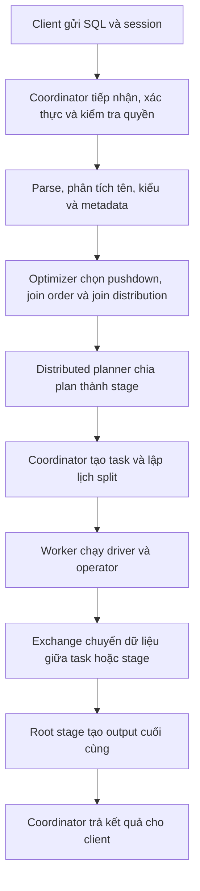
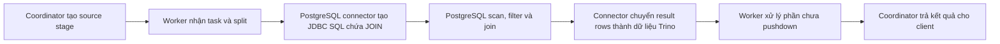
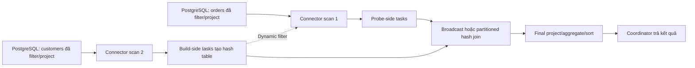

# Trino thực thi truy vấn như thế nào

> Tài liệu này được đối chiếu với Trino 483 ngày 2026-07-22.

Trino là một distributed SQL query engine. Client gửi SQL đến coordinator; coordinator phân tích, tối ưu và điều phối query; worker thực thi task, đọc dữ liệu qua connector và trao đổi dữ liệu trung gian với các worker khác. Trino không lưu bảng nguồn: catalog và connector xác định data source cũng như cách truy cập dữ liệu.

Điểm quan trọng đối với query nối hai bảng PostgreSQL là Trino không mặc định tải toàn bộ hai bảng rồi mới nối. Trino cố gắng đẩy điều kiện lọc, danh sách cột và, khi phù hợp, toàn bộ phép nối xuống PostgreSQL. Nếu không thể đẩy phép nối, Trino đọc dữ liệu đã được rút gọn từ từng nguồn rồi thực hiện distributed hash join trên các worker.

## 1. Trách nhiệm của từng thành phần

| Thành phần | Trách nhiệm chính |
| --- | --- |
| Client | Gửi SQL và session properties; nhận dần các trang kết quả hoặc thông báo lỗi. |
| Coordinator | Nhận query, xác thực và kiểm tra quyền, parse SQL, phân tích tên/kiểu, lấy metadata/statistics, tối ưu plan, tạo stage/task và theo dõi toàn bộ query. |
| Worker | Thực thi task và driver; đọc dữ liệu qua connector; chạy filter, projection, join, aggregate, sort và trao đổi dữ liệu với worker khác. |
| Catalog | Cấu hình một kết nối logic tới data source. Tên catalog là phần đầu của tên đầy đủ `catalog.schema.table`. |
| PostgreSQL connector | Chuyển đổi giữa mô hình Trino và PostgreSQL; lấy metadata/statistics; xác định pushdown; tạo JDBC query; ánh xạ kiểu và chuyển dữ liệu nguồn thành dữ liệu nội bộ của Trino. |
| PostgreSQL | Lập execution plan của remote SQL; dùng index hoặc table scan; thực hiện filter, join, aggregate, limit hoặc Top-N đã được pushdown. |

Coordinator là control plane của query. Worker là execution plane. Trong môi trường phát triển, một Trino node có thể được cấu hình làm đồng thời coordinator và worker, nhưng hai vai trò logic vẫn khác nhau.

## 2. Luồng tổng quát của một query



Trình tự cụ thể:

1. Client gửi SQL, user identity, catalog/schema mặc định và session properties đến coordinator.
2. Coordinator tiếp nhận query, áp dụng authentication, access control và resource group nếu được cấu hình.
3. Analyzer parse SQL, phân giải `catalog.schema.table`, kiểm tra column, function, biểu thức và kiểu dữ liệu. Coordinator gọi connector để lấy metadata và statistics; dữ liệu bảng chưa được đọc ở bước này.
4. Optimizer tạo và biến đổi logical plan. Trino loại bỏ cột không cần thiết, đẩy filter về gần table scan, sắp xếp lại join và hỏi connector về các operation có thể pushdown.
5. Cost-based optimizer dùng statistics để chọn join order, build/probe side, join distribution và quyết định liệu join pushdown có lợi hay không.
6. Distributed planner chia plan thành các fragment/stage. Coordinator triển khai mỗi stage thành task trên worker và lập lịch các split do connector cung cấp.
7. Worker chạy task bằng một hoặc nhiều driver. Mỗi driver là chuỗi operator như `TableScan`, `Filter`, `Project`, `Join`, `Aggregate` hoặc `Output`.
8. Exchange chuyển output giữa task, stage hoặc worker. Root stage tạo output cuối cùng; coordinator nhận và trả dần kết quả cho client.

Các bước thực thi không hoàn toàn tuần tự. Nhiều task, split và driver chạy song song hoặc theo pipeline. Tuy nhiên, với hash join, phía build phải tạo được hash table trước khi phía probe có thể dò kết quả.

## 3. Các đơn vị thực thi

| Khái niệm | Vai trò |
| --- | --- |
| Statement | Văn bản SQL do client gửi. |
| Query | Statement cùng plan, stage, task, split, connector và trạng thái thực thi được tạo để sinh kết quả. |
| Stage | Một phần logic của distributed plan. Các stage tạo thành cây; stage không trực tiếp chạy trên worker. |
| Task | Instance thực thi một stage trên một worker. Task có input/output và chứa nhiều driver. |
| Split | Phần dữ liệu nguồn do connector cung cấp để task xử lý. Số lượng và cách chia split phụ thuộc connector. |
| Driver | Chuỗi operator instance trong bộ nhớ, có một input và một output; đây là mức song song hóa thấp nhất của Trino. |
| Operator | Thành phần đọc hoặc biến đổi dữ liệu, ví dụ table scan, filter, join hay aggregate. |
| Exchange | Kênh chuyển output giữa task, stage hoặc node. Task ghi vào output buffer và nhận dữ liệu qua exchange client. |

Có thể ghi nhớ theo thứ tự:

```text
Query → Stage → Task → Driver → Operator
                 ↓
               Split
```

## 4. Ví dụ: nối hai bảng PostgreSQL

Query sau đọc hai bảng trong cùng catalog `pg` và cùng PostgreSQL database.

```sql
SELECT
    o.order_id,
    c.customer_name
FROM pg.sales.orders AS o
JOIN pg.sales.customers AS c
    ON o.customer_id = c.customer_id
WHERE o.created_at >= DATE '2026-07-01'
  AND c.country = 'VN';
```

Logical plan ban đầu có dạng khái niệm:

```text
Output
└─ Project(order_id, customer_name)
   └─ Join(o.customer_id = c.customer_id)
      ├─ Filter(o.created_at >= DATE '2026-07-01')
      │  └─ Scan(orders)
      └─ Filter(c.country = 'VN')
         └─ Scan(customers)
```

Trước khi thực thi, optimizer cố gắng:

- Chỉ đọc `order_id` và `customer_id` từ `orders`.
- Chỉ đọc `customer_id` và `customer_name` từ `customers`.
- Đẩy điều kiện ngày xuống scan của `orders`.
- Đẩy `country = 'VN'` xuống scan của `customers`.
- Quyết định thực hiện join trong PostgreSQL hay trong Trino.

PostgreSQL connector ưu tiên tính đúng đắn. Một operation không được pushdown nếu semantics của PostgreSQL có thể tạo kết quả khác Trino, ngay cả khi pushdown có vẻ nhanh hơn.

## 5. Quyết định join pushdown

Join chỉ có thể được pushdown khi thỏa các điều kiện cơ bản sau:

- Hai bảng thuộc cùng một catalog.
- Mọi predicate thuộc join có thể được connector pushdown.
- PostgreSQL connector hỗ trợ operation và kiểu dữ liệu liên quan.
- Với chiến lược cost-based mặc định, statistics cho thấy pushdown có lợi.

Các mặc định quan trọng của PostgreSQL connector:

| Catalog property | Mặc định | Ý nghĩa |
| --- | --- | --- |
| `join-pushdown.enabled` | `true` | Cho phép connector cân nhắc đẩy join xuống PostgreSQL. |
| `join-pushdown.strategy` | `AUTOMATIC` | Chỉ pushdown khi cost-based decision dựa trên statistics cho thấy có lợi. |
| `dynamic-filtering.enabled` | `true` | Cho phép đẩy dynamic filter vào JDBC query. |
| `dynamic-filtering.wait-timeout` | `20s` | Thời gian tối đa chờ dynamic filter từ build side trước khi bắt đầu JDBC query. |

Với `join-pushdown.strategy=AUTOMATIC`, nếu không có table statistics, connector không pushdown join để tránh chọn một remote plan có thể chậm hơn. `EAGER` cố gắng pushdown bất cứ khi nào có thể nhưng chỉ nên dùng để kiểm thử hoặc troubleshooting.

Chạy câu lệnh sau trong PostgreSQL để thu statistics cho một bảng.

```sql
ANALYZE table_schema.table_name;
```

Một PostgreSQL catalog chỉ truy cập một database. Hai PostgreSQL database hoặc server khác nhau cần hai catalog khác nhau; vì vậy join giữa chúng không thể được pushdown thành một remote PostgreSQL join.

Ngay cả khi hai catalog trỏ tới cùng một PostgreSQL server hoặc database, điều kiện “cùng catalog” vẫn không đạt. Trino phải xử lý join, mặc dù filter và projection riêng của mỗi scan vẫn có thể được pushdown.

## 6. Trường hợp A: PostgreSQL thực hiện join



Trình tự thực thi:

1. Optimizer thay hai table scan và join bằng một remote table handle đại diện cho query PostgreSQL.
2. Coordinator tạo source stage và task tương ứng.
3. Worker gọi PostgreSQL connector. Connector mở JDBC connection và gửi remote SQL có filter, projection và join đã được pushdown.
4. PostgreSQL tự lập plan, chọn index/table scan và join algorithm của PostgreSQL.
5. PostgreSQL trả các dòng đã join qua JDBC.
6. Connector ánh xạ kiểu và chuyển dữ liệu sang representation nội bộ của Trino.
7. Worker thực hiện các operation còn lại chưa được pushdown rồi đưa output tới stage tiếp theo hoặc output buffer.
8. Coordinator trả kết quả cho client.

Ưu điểm chính là giảm dữ liệu truyền từ PostgreSQL sang Trino và giảm lượng dữ liệu mà worker phải join. Tuy nhiên, join pushdown không phải lúc nào cũng nhanh hơn: một join có thể tạo output lớn hơn tổng input hoặc PostgreSQL có thể không đủ tài nguyên cho workload đó. Vì vậy connector dùng cost-based decision thay vì luôn pushdown.

## 7. Trường hợp B: Trino thực hiện join

Trino thực hiện join khi query dùng nhiều catalog hoặc khi connector/optimizer từ chối join pushdown.

Ví dụ sau dùng hai catalog PostgreSQL khác nhau.

```sql
SELECT
    o.order_id,
    c.customer_name
FROM pg_sales.public.orders AS o
JOIN pg_crm.public.customers AS c
    ON o.customer_id = c.customer_id
WHERE o.created_at >= DATE '2026-07-01'
  AND c.country = 'VN';
```



Trình tự thực thi:

1. Trino tạo hai source scan độc lập. Mỗi connector instance gửi JDBC query tới PostgreSQL tương ứng.
2. Predicate và projection được pushdown riêng khi connector hỗ trợ, nên PostgreSQL chỉ trả các hàng và cột cần thiết.
3. Worker nhận dữ liệu từ hai nguồn và Trino chọn một bên làm build side, bên còn lại làm probe side.
4. Build side tạo hash table theo join key. Probe side đọc từng dòng, tính hash của join key và dò trong hash table.
5. Nếu có hàng phù hợp, join operator tạo dòng kết quả kết hợp từ hai phía.
6. Exchange chuyển dữ liệu giữa worker nếu join cần broadcast hoặc repartition.
7. Các operator sau join thực hiện project, aggregate, sort hoặc limit còn lại.
8. Root stage tạo output và coordinator trả kết quả cho client.

SQL viết bảng nào ở bên phải không bảo đảm bảng đó luôn là build side. Khi có statistics, cost-based optimizer có thể reorder join và chọn build/probe side dựa trên chi phí ước tính.

## 8. Build side và probe side

Trino dùng hash-based join:

- **Build side — phía dựng:** Trino đọc phía này để tạo hash table trong bộ nhớ. Optimizer thường cố chọn tập dữ liệu nhỏ hơn sau filter.
- **Probe side — phía dò:** Trino đọc từng dòng, lấy join key và dò hash table để tìm hàng phù hợp.

Ví dụ, nếu `customers` sau `country = 'VN'` nhỏ hơn `orders`, Trino có thể dựng hash table sau:

```text
customer_id 101 → customer row A
customer_id 102 → customer row B
```

Khi một dòng `orders` có `customer_id = 102` đi qua probe side, join operator dò key `102`, tìm `customer row B` rồi tạo output từ hai dòng.

Build side phải phù hợp với giới hạn memory của join distribution được chọn. Chọn sai build side hoặc statistics cũ có thể làm tăng memory, network traffic hoặc gây query failure.

## 9. Broadcast join và partitioned join

| Kiểu phân phối | Cách hoạt động | Khi phù hợp | Chi phí/rủi ro |
| --- | --- | --- | --- |
| Broadcast | Sao chép toàn bộ build side đến mỗi node tham gia join; mỗi node tạo hash table đầy đủ. | Build side sau filter nhỏ hơn nhiều so với probe side. | Build side phải vừa bộ nhớ trên từng node; dữ liệu được nhân bản qua network. |
| Partitioned | Hash-repartition cả hai phía theo join key; mỗi node chỉ tạo hash table từ một phần build side. | Cả hai phía lớn hoặc build side không phù hợp để broadcast. | Phải truyền lại cả hai phía qua network và nhạy với data skew. |

Với cost-based join distribution, Trino tự động chọn broadcast hoặc partitioned. Broadcast thường nhanh hơn khi build side nhỏ; partitioned cho phép thực hiện join lớn hơn bằng tổng memory của cluster.

## 10. Dynamic filtering

Dynamic filtering dùng giá trị join key quan sát được ở build side để giảm dữ liệu phải đọc từ probe side.

Trong ví dụ:

1. Trino đọc `customers` đã lọc theo `country = 'VN'`.
2. Build side thu tập hoặc miền `customer_id` còn lại.
3. Dynamic filter được chuyển tới probe-side scan của `orders`.
4. PostgreSQL connector có thể thêm runtime predicate vào JDBC query của `orders`.
5. PostgreSQL trả ít hàng hơn; Trino giảm network, memory và CPU cho join.

Dynamic filtering được bật mặc định, nhưng không bảo đảm luôn được áp dụng. Nó phụ thuộc loại join, join predicate, kích thước build side, planner support và connector support. Với PostgreSQL connector, `dynamic-filtering.wait-timeout` điều khiển thời gian chờ filter trước khi bắt đầu JDBC query; timeout lớn hơn có thể tạo filter chi tiết hơn nhưng cũng tăng latency.

Dùng `EXPLAIN` để tìm `dynamicFilterAssignments` ở join node và dynamic filter tại probe-side scan.

## 11. Predicate pushdown của PostgreSQL

PostgreSQL connector hỗ trợ predicate pushdown cho phần lớn kiểu dữ liệu, gồm `UUID`, `DATE` và các kiểu thời gian. Tuy nhiên, range predicate như `>`, `<` hoặc `BETWEEN` trên `CHAR`/`VARCHAR` không được pushdown mặc định vì thứ tự sắp xếp chuỗi của PostgreSQL có thể khác semantics của Trino.

Trong ví dụ chính:

- `o.created_at >= DATE '2026-07-01'` có thể được pushdown.
- `c.country = 'VN'` có thể được pushdown.
- Một điều kiện như `c.customer_name > 'M'` trên `VARCHAR` không được pushdown mặc định và có thể được Trino xử lý sau khi đọc dữ liệu.

Không suy luận pushdown chỉ từ cú pháp SQL. Luôn kiểm tra execution plan thực tế.

## 12. Kiểm tra bằng EXPLAIN

Chạy câu lệnh sau để xem distributed plan mà không thực thi query dữ liệu.

```sql
EXPLAIN (TYPE DISTRIBUTED)
SELECT
    o.order_id,
    c.customer_name
FROM pg.sales.orders AS o
JOIN pg.sales.customers AS c
    ON o.customer_id = c.customer_id
WHERE o.created_at >= DATE '2026-07-01'
  AND c.country = 'VN';
```

Nếu join được pushdown:

- Plan không còn `Join` operator của Trino.
- Thường thấy một `TableScan` có dạng `postgres:Query[...]`.
- Remote query trong table scan chứa phép join PostgreSQL.

Nếu Trino thực hiện join:

- Plan còn `Join` operator.
- Có hai table scan hoặc hai source branch.
- Có thể thấy broadcast/replicate hoặc hash partitioning và remote exchange.
- Build/probe side xuất hiện trong cấu trúc join plan.

Sau khi kiểm tra plan, chạy câu lệnh sau khi cần thống kê thực thi thật.

```sql
EXPLAIN ANALYZE
SELECT
    o.order_id,
    c.customer_name
FROM pg.sales.orders AS o
JOIN pg.sales.customers AS c
    ON o.customer_id = c.customer_id
WHERE o.created_at >= DATE '2026-07-01'
  AND c.country = 'VN';
```

`EXPLAIN ANALYZE` thực sự chạy statement. Không dùng tùy tiện với query lớn hoặc operation ghi dữ liệu. Output cho biết CPU time, scheduled time, blocked time, input/output rows và distribution theo task; các số liệu này giúp phát hiện source chậm, data skew, network exchange lớn hoặc build side bị ước tính sai.

Web UI của coordinator cho phép xem stage graph, task, timeline, memory và JSON statistics của query. Trạng thái `BLOCKED` trong thời gian ngắn có thể bình thường; nếu kéo dài, kiểm tra input/output buffer, memory, source I/O, network, data skew và tốc độ client đọc kết quả.

## 13. Các điểm dễ hiểu sai

- Coordinator lập plan và điều phối; worker mới là nơi thực thi task và xử lý dữ liệu. Một node development có thể kiêm cả hai vai trò.
- Cùng PostgreSQL server không đồng nghĩa với cùng catalog. Join pushdown yêu cầu hai bảng thuộc cùng catalog.
- Join pushdown được bật không có nghĩa mọi join đều được pushdown. Statistics, predicate, kiểu dữ liệu, semantics và cost đều ảnh hưởng quyết định.
- Bảng nằm bên phải trong SQL không luôn là build side; optimizer có thể reorder join.
- Dynamic filtering khác predicate tĩnh trong `WHERE`: dynamic filter chỉ được tạo trong runtime sau khi xử lý build side.
- Broadcast không có nghĩa “không dùng network”; build side vẫn phải được sao chép tới các node.
- Partitioned join không có nghĩa “không dùng memory”; mỗi node vẫn cần hash table cho phần build side của nó.
- `EXPLAIN` chỉ cho plan; `EXPLAIN ANALYZE` chạy query và cung cấp số liệu thực tế.

## 14. Checklist kiểm tra query nối PostgreSQL

- [ ] Hai bảng cùng hay khác catalog đã được xác định rõ.
- [ ] PostgreSQL đã có table/column statistics cập nhật.
- [ ] `EXPLAIN (TYPE DISTRIBUTED)` đã được kiểm tra trước query lớn.
- [ ] Nếu kỳ vọng join pushdown, plan không còn `Join` operator và remote `TableScan` chứa join.
- [ ] Nếu Trino tự join, build/probe side và broadcast/partitioned distribution đã được kiểm tra.
- [ ] Predicate và projection pushdown đã được xác nhận trên từng scan.
- [ ] Dynamic filter xuất hiện trong plan khi query đủ điều kiện.
- [ ] Build side phù hợp với memory và không bị ước tính sai do statistics cũ.
- [ ] Exchange volume và data skew đã được kiểm tra trong `EXPLAIN ANALYZE` hoặc Web UI.
- [ ] `EXPLAIN ANALYZE` chỉ được chạy khi chấp nhận việc query thực sự được thực thi.

## References

- [Trino — Concepts and query execution model](https://trino.io/docs/current/overview/concepts.html)
- [Trino — PostgreSQL connector](https://trino.io/docs/current/connector/postgresql.html)
- [Trino — Pushdown](https://trino.io/docs/current/optimizer/pushdown.html)
- [Trino — Cost-based optimizations](https://trino.io/docs/current/optimizer/cost-based-optimizations.html)
- [Trino — Dynamic filtering](https://trino.io/docs/current/admin/dynamic-filtering.html)
- [Trino — EXPLAIN](https://trino.io/docs/current/sql/explain.html)
- [Trino — EXPLAIN ANALYZE](https://trino.io/docs/current/sql/explain-analyze.html)
- [Trino — Web UI](https://trino.io/docs/current/admin/web-interface.html)
